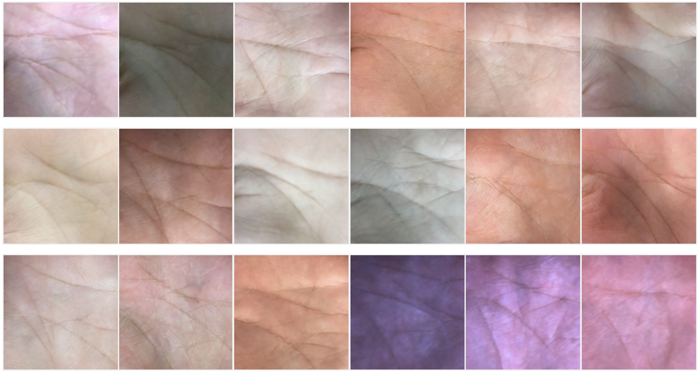

# BCLCM-Plam

Regarding the fine-tuning of VQ-VAE, the training of the Style Transfer module, the calculation of FID and TAR@FAR, and other related work, please refer to CLDM-Palm [https://github.com/Ceabeans/Code](https://github.com/Ceabeans/Code) for detailed information. 

Here, we mainly introduce the training of the Latent Easy Consistency Training (LECT)  module and the final sampling process. 

Readers interested in Easy Consistency Tuning (ECT) can refer to [https://github.com/locuslab/ect](https://github.com/locuslab/ect) for further details.

## Training and Sample Collection for BCLCM-Palm

1. **Train the LECT module:**
   
   Modify the model parameter path, dataset path, and other related paths to your own paths. Run LECT.py
   
3. **Sampling:**

   Adjust sampling steps, output path, etc., as needed and run `sample.py`.
